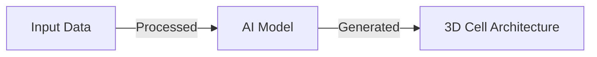

# Cell Architect
## Introduction
Cell Architect is a Python library for generating 3D cell architectures using AI-powered algorithms.
## Problem Statement
Current methods for generating 3D cell architectures are limited by their reliance on manual input and lack of scalability.
## Why it Matters
The ability to generate accurate 3D cell architectures has significant implications for medical research and education.
## Architecture

## Project Structure
```
 cell-architect/
|---- README.md
|---- CONTRIBUTING.md
|---- requirements.txt
|---- main.py
|---- src/
|       |---- __init__.py
|       |---- core.py
|       |---- utils.py
```
## Installation
1. Clone the repository: `git clone https://github.com/your-username/cell-architect.git`
2. Install the requirements: `pip install -r requirements.txt`
## Quick Start
1. Run the main script: `python main.py --help`
## Configuration
The library can be configured using the `config.json` file.
## Design Decisions
The library uses a modular structure to ensure scalability and maintainability.
## Roadmap
* Improve the accuracy of the AI model
* Add support for multiple input formats
* Develop a user-friendly interface
## Contribution
Contributions are welcome. Please follow the guidelines outlined in the `CONTRIBUTING.md` file.
## License
The library is licensed under the MIT License.