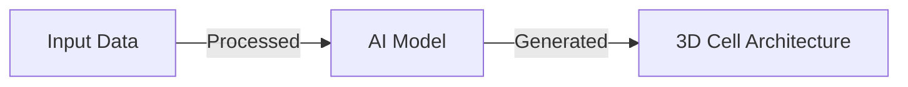

# Cell Architect
## Introduction
Cell Architect is a Python library for generating 3D cell architectures using AI-powered algorithms.
## Problem Statement
Current methods for generating 3D cell architectures are limited by their reliance on manual input and lack of scalability.
## Why it Matters
The ability to generate accurate 3D cell architectures has significant implications for medical research and education.
## Features

- AI-powered 3D cell architecture generation
- Modular project structure
- Configurable workflow
- Scalable Python architecture
## Architecture

## Project Structure
```text
cell-architect/
├── README.md
├── CONTRIBUTING.md
├── requirements.txt
├── main.py
└── src/
    ├── __init__.py
    ├── core.py
    └── utils.py
```
## Prerequisites

- Python 3.9+
- pip
- virtual environment (recommended)

## Installation

1. Clone the repository:

```bash
git clone https://github.com/sanjaygokul-ikify/cell-architect.git
```

2. Move into the project folder:

```bash
cd cell-architect
```

3. Install the requirements:

```bash
pip install -r requirements.txt
```

## Setup Virtual Environment

### Windows
```bash
python -m venv venv
venv\Scripts\activate
```

### Linux/macOS
```bash
python3 -m venv venv
source venv/bin/activate
```
## Quick Start

Run the main script:

```bash
python main.py --help
```

This command displays available CLI options and usage instructions.
## Configuration
The library can be configured using the `config.json` file.
## Design Decisions
The library uses a modular structure to ensure scalability and maintainability.
## Roadmap
* Improve the accuracy of the AI model
* Add support for multiple input formats
* Develop a user-friendly interface
## Contribution
Contributions are welcome. Please follow the guidelines outlined in the `CONTRIBUTING.md` file.
## License
The library is licensed under the MIT License.
